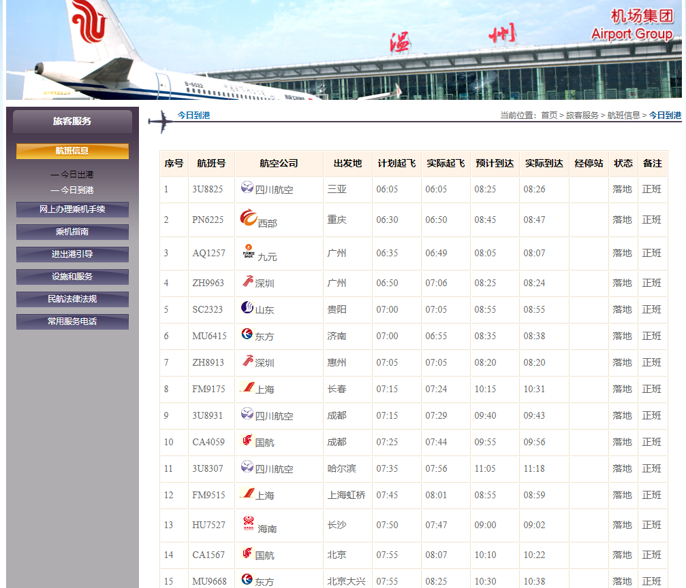
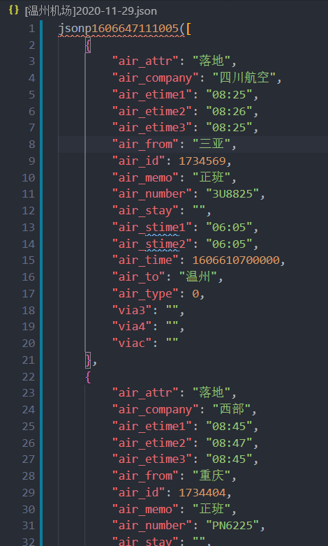
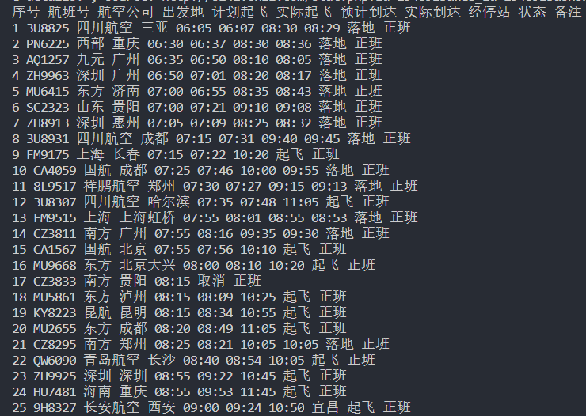

# 计网作业：爬虫

> [温州机场数据地址](http://www.wzair.cn/lkfw/hbxx/jrdg/index.html?v=1606439135598&rxLoad=1&_rand=1606586459057)

原网站概览：



## 使用说明

### 环境配置方法

- Scrapy

```
pip install Scrapy
scrapy startproject airport
cd airport # 进入项目airport目录
scrapy genspider wenzhou http://www.wzair.cn/lkfw/hbxx/jrdg/index.html?v=1606439135598&rxLoad=1&_rand=1606586459057
```

- selenium

[见教程：爬取动态渲染网站](https://sunflowercoder.com/Scrapy-Selenium%E7%88%AC%E5%8F%96%E5%8A%A8%E6%80%81%E6%B8%B2%E6%9F%93%E7%BD%91%E7%AB%99/)

### 代码运行说明

在外层airport文件夹下，输入以下命令，即可运行（每24h爬取一次数据）

```bash
python main.py # 使用python 3版本
```

## 实验过程

一开始，我使用scrapy框架进行爬取，发现自xpath中自//table后，便无法获得向下节点的对应信息。于是，我考虑了用以下两种方式来爬：

- 获取API
- selenium模拟网页行为爬取

### 通过API

```python
import requests
import time
import re
import datetime
import json
import os

se = requests.session()

post_url = "http://121.40.33.186:12800/services/wzairAuto/arrival?callback=jsonp1606647111005&_=1606647111010"
while True:
    ti = datetime.datetime.now().strftime('%Y-%m-%d')
    filename = '[温州机场]'+ti+'.json'
    data = se.get(post_url).text.replace("'", '"').replace('/ ', '/')
    with open(filename,"w", encoding="utf-8") as f:
        f.write(data)
    # os.system("scrapy crawl wenzhou")
    print("load data success! ",ti)
    time.sleep(3600*24) # 每24小时爬一次
```

### 通过selenium

在`airport/app.py`中，代码如下：

```python
from selenium import webdriver
from selenium.webdriver.chrome.options import Options
import time

chrome_options = Options()
chrome_options.add_argument("--headless")
driver = webdriver.Chrome(
    executable_path='chromedriver',
    options=chrome_options)
driver.get('http://www.wzair.cn/lkfw/hbxx/jrdg/index.html?v=1606439135598/')
time.sleep(5)
li = driver.find_elements_by_xpath("//td[@id='hangbanInfoBox']/table/tbody/tr")
for i in li:
    print(i.text)
driver.close()
```

## 数据相关

### API法

#### 数据截图



共125条

#### 字段说明

以爬得的第一条数据为例：

```json
    {
        "air_attr": "落地", // 状态
        "air_company": "四川航空", // 航空公司
        "air_etime1": "08:25", // 预计到达
        "air_etime2": "08:26", // 实际到达
        "air_etime3": "08:25", // 多余字段
        "air_from": "三亚", // 出发地
        "air_id": 1734569, // 航班编号
        "air_memo": "正班", // 备注
        "air_number": "3U8825", // 航班号
        "air_stay": "", // 经停站
        "air_stime1": "06:05", // 计划起飞
        "air_stime2": "06:05", // 实际起飞
        "air_time": 1606610700000, // 时间
        "air_to": "温州", // 到达地
        "air_type": 0, // 类型
        "via3": "", // 冗余字段
        "via4": "", // 冗余字段
        "viac": "" // 冗余字段
    }
```

### selenium法

#### 数据截图



#### 字段说明

与网页中的表格项一一对应。分别是：

序号 航班号 航空公司 出发地 计划起飞 实际起飞 预计到达 实际到达 经停站 状态 备注