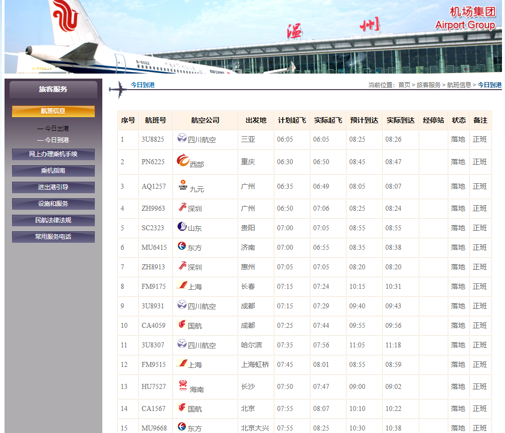
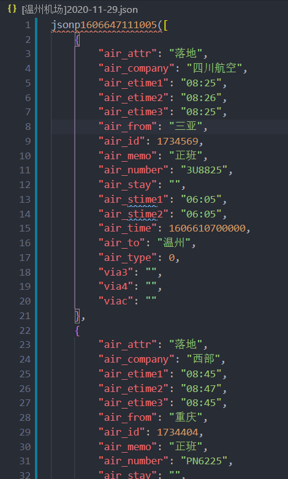

# 计网作业：爬虫

## 使用说明

### 环境配置方法

```
pip install Scrapy
scrapy startproject airport
cd airport # 进入项目airport目录
scrapy genspider wenzhou http://www.wzair.cn/lkfw/hbxx/jrdg/index.html?v=1606439135598&rxLoad=1&_rand=1606586459057
```

### 代码运行说明

在最外层的airport文件夹下，输入以下命令，即可运行（每24h爬取一次数据）

```bash
python main.py # 使用python 3版本
```

## 爬取数据说明&截图

### 原网站



### 截图



共125条

### 字段说明

以爬得的第一条数据为例：

```json
    {
        "air_attr": "落地", // 状态
        "air_company": "四川航空", // 航空公司
        "air_etime1": "08:25", // 预计到达
        "air_etime2": "08:26", // 实际到达
        "air_etime3": "08:25", // 多余字段
        "air_from": "三亚", // 出发地
        "air_id": 1734569, // 航班编号
        "air_memo": "正班", // 备注
        "air_number": "3U8825", // 航班号
        "air_stay": "", // 经停站
        "air_stime1": "06:05", // 计划起飞
        "air_stime2": "06:05", // 实际起飞
        "air_time": 1606610700000, // 时间
        "air_to": "温州", // 到达地
        "air_type": 0, // 类型
        "via3": "", //冗余字段
        "via4": "", //冗余字段
        "viac": "" //冗余字段
    }
```